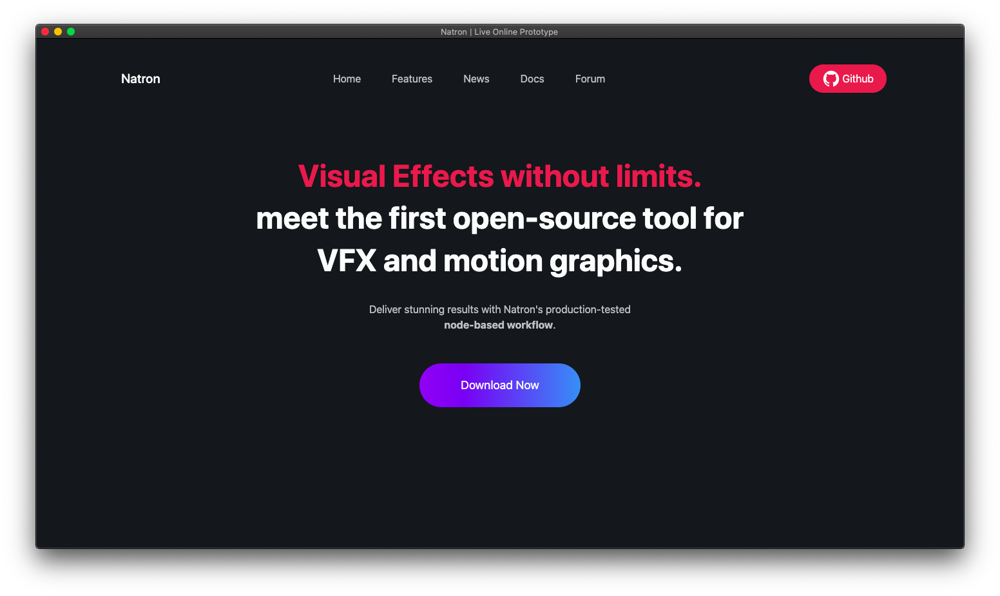

# Natron Web Prototype

A live demo of the designs of the [Natron UI/UX Project](https://github.com/Songtech-0912/natron-ui-ux-design).

## About

Welcome! If you're interested in Natron, web design, or both, this is the right place for you.

Here, you'll find the code for a live prototype for Natron's website. This is a work-in-progress, and is currently missing a lot of features:



This repository is part design, part code. I think that each should work for the betterment of the other. For this, we maximise the flexability of our code, making it easy to change designs and improve on each design. In order to adhere to this iterative development model, the project uses Tailwind CSS, a very flexible framework that is easy to write, easy to learn, and easy to customize. Don't worry; you don't have to know much about Tailwind CSS to contribute. This repository should explain everything neccesary to get started.

## Get Started

This repository is super simple to work with. I'm assuming you have `node.js`, `npm`, and `npx` preinstalled; if not, see [these instructions](help/beginners-help.md) to get up to speed.

First, clone this repository:

```
git clone https://github.com/this-repositories-name
```

Then, install the dependencies:

```
npm install
```

Lastly, compile tailwind into static css files, and open an auto-updating development server:

```
npm run dev
npm run start
```

This should automatically open your default browser to <http://localhost:8080>. If something weird happens, or the commands don't work as expected, see [help/troubleshooting.md](help/troubleshooting.md).

## Roadmap
